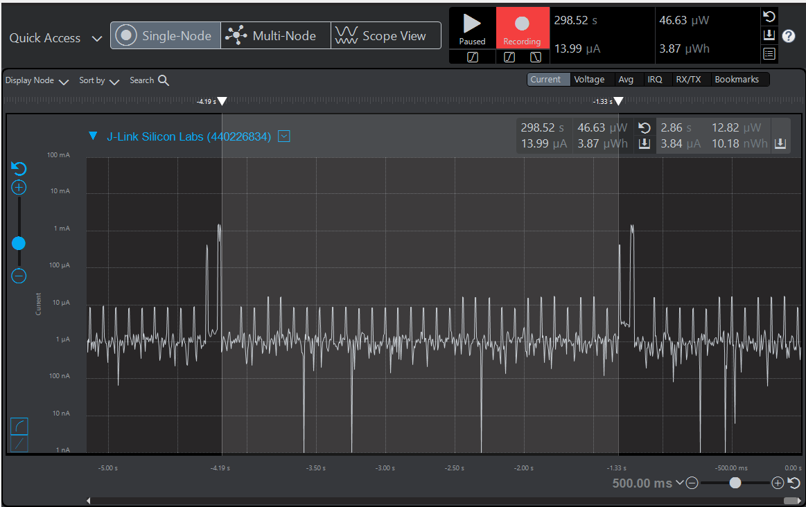

Please include your answers to the questions below with your submission, entering into the space below each question
See [Mastering Markdown](https://guides.github.com/features/mastering-markdown/) for github markdown formatting if desired.

*Be sure to take measurements with logging disabled to ensure your logging logic is not impacting current/time measurements.*

*Please include screenshots of the profiler window detailing each current measurement captured.  See the file Instructions to add screenshots in assignment.docx in the ECEN 5823 Student Public Folder.* 

1. What is the average current per period?
   Answer: 13.27 uA
    Screenshot:  
     

2. What is the average current when the Si7021 is Powered Off?
   Answer: 3.84 uA
    Screenshot:  
     

3. What is the average current when the Si7021 is Powered On?
   Answer: 177.51 uA
    Screenshot:  
     

4. How long is the Si7021 Powered On for 1 temperature reading?
   Answer: 115ms
    Screenshot:  
     

5. Compute what the total operating time of your design for assignment 4 would be in hours, assuming a 1000mAh battery power supply?
   Answer: 62.79 hours
   
6. How has the power consumption performance of your design changed since the previous assignment?
   Answer: The power consumption has drastically reduced, since we have made the code interrupt driven. Also, since we spend major time sleeping
           in EM3 energy mode.
		   
7. Describe how you tested your code for EM1 during I2C transfers?
   Answer: From the energy profiler graph generated we observe that there are two spikes one after another. We observe that there is reduction in
           current consumption after the first write( first spike) and before the next read( the second spike). Thus it is evident that we are in EM1
		   energy mode during I2C transfers.
   
